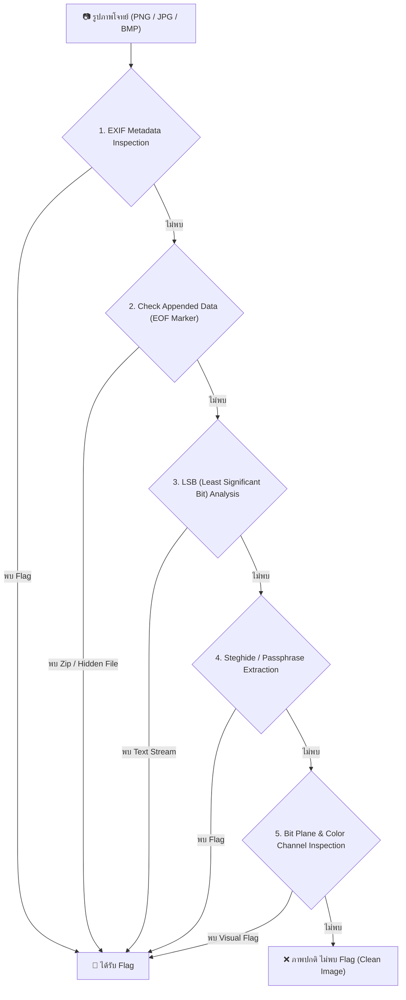

# 🚩 คู่มือและเทคนิคการค้นหา Flag จากรูปภาพ (CTF Image Steganography Guide)

คู่มือนี้สรุปขั้นตอนและเทคนิคมาตรฐานในการแกะหา **Flag ของจริงที่ซ่อนอยู่ในรูปภาพ** เพื่อใช้เป็นพิมพ์เขียว (Blueprint) ในการปรับแต่ง AI Agent (`StegHunter` / `ForensicX`) และการประมวลผลของระบบ

---

## 🛠️ 1. ขั้นตอนการตรวจสอบและสกัด Flag จากรูปภาพ (Step-by-Step Methodology)



---

## 🔬 2. รายละเอียดแต่ละเทคนิค (Techniques Breakdown)

### เทคนิคที่ 1: EXIF Metadata & Chunk Analysis
- **หลักการ:** ซ่อนข้อความไว้ในแอตทริบิวต์ของภาพ เช่น `UserComment`, `Artist`, `Copyright`, `Software` หรือ Chunk พิเศษของ PNG (`tEXt`, `zTXt`)
- **คำสั่ง / โค้ดสำหรับสกัด:**
  ```bash
  # ตรวจสอบ EXIF ทั้งหมด
  exiftool challenge.png

  # สกัดสตริงก์ข้อความจากไฟล์ภาพ
  strings -n 6 challenge.jpg | grep -iE "flag|ctf|\{"
  ```
- **การสอน AI:** สั่งให้ Agent อ่าน `EXIF` และ `tEXt` chunks ทุกครั้งก่อนวิเคราะห์พิกเซล

---

### เทคนิคที่ 2: Check Appended Data (Carving / EOF Hiding)
- **หลักการ:** ต่อท้ายไฟล์ภาพด้วยไฟล์ซิป หรือข้อความลับหลังจุดสิ้นสุดของภาพ (EOF Marker)
  - PNG EOF: `49 45 4E 44 AE 42 60 82` (`IEND`)
  - JPEG EOF: `FF D9`
- **คำสั่ง / โค้ดสำหรับสกัด:**
  ```bash
  # สแกนหาไฟล์ที่ซ่อนอยู่ภายในภาพ (เช่น ZIP, TAR, ELF)
  binwalk -e challenge.png

  # สกัดด้วย foremost
  foremost -i challenge.jpg
  ```
- **การสอน AI:** สั่งให้ Agent ตรวจสอบขนาดไฟล์เทียบกับความยาวปกติ หากมีข้อมูลเกินหลัง EOF ให้สกัดไฟล์ที่ซ่อนออกมา

---

### เทคนิคที่ 3: LSB (Least Significant Bit) Steganography
- **หลักการ:** ซ่อนบิตข้อความไว้ที่ Bit 0 (บิตที่มีนัยสำคัญน้อยที่สุด) ของช่องสี Red, Green, Blue หรือ Alpha
- **คำสั่ง / โค้ดสำหรับสกัด:**
  ```bash
  # ใช้ zsteg สำหรับไฟล์ PNG/BMP
  zsteg -a challenge.png

  # สกัด LSB ด้วย Python
  python3 -c "
  from PIL import Image
  img = Image.open('challenge.png')
  pixels = list(img.getdata())
  binary = ''.join([str(p[0] & 1) for p in pixels])
  bytes_data = [int(binary[i:i+8], 2) for i in range(0, len(binary), 8)]
  print(''.join([chr(b) for b in bytes_data if 32 <= b <= 126]))
  "
  ```
- **การสอน AI:** สั่งให้ Agent สแกน LSB ในลำดับ RGB, BGR, Alpha และเปลี่ยนทิศทาง Row-first / Column-first

---

### เทคนิคที่ 4: Steghide (JPEG / BMP Encryption)
- **หลักการ:** เข้ารหัสข้อความและซ่อนไว้ในไฟล์ JPEG/BMP โดยใช้รหัสผ่าน (Passphrase)
- **คำสั่ง / โค้ดสำหรับสกัด:**
  ```bash
  # สกัดด้วยรหัสผ่านว่าง (Empty Password)
  steghide extract -sf challenge.jpg -p ""

  # Brute-force รหัสผ่านด้วย stegseek / stegcracker
  stegseek challenge.jpg rockyou.txt
  ```
- **การสอน AI:** สั่งให้ Agent ทดลองรหัสผ่านว่าง `""`, `123456`, `password` หรือใช้ชื่อไฟล์เป็นรหัสผ่าน

---

### เทคนิคที่ 5: Bit Plane & Color Channel Visual Inspection
- **หลักการ:** ซ่อนข้อความหรือ QR Code ไว้ในระนาบบิตเฉพาะ (เช่น Red Plane 0, Green Plane 0) หรือปรับความสว่าง/ความต่างสี (Brightness/Contrast)
- **คำสั่ง / โค้ดสำหรับสกัด:**
  - สลับระนาบสีด้วย **StegSolve** (Red Plane 0, Green Plane 0, Blue Plane 0, Random Color Map)
  - หรือใช้ Python (Pillow / OpenCV):
  ```python
  from PIL import Image

  img = Image.open('challenge.png')
  r, g, b = img.split()
  # ดึง Red Plane 0
  r_bit0 = r.point(lambda p: (p & 1) * 255)
  r_bit0.save('red_bit0.png')
  ```
- **การสอน AI:** หากใช้โมเดล Vision (เช่น Gemini Multimodal) สั่งให้ทำ Image Processing สกัด Bit Plane 0 และส่งภาพ Bit Plane เข้าสู่ Vision OCR เพื่ออ่านข้อความ Flag

---

## 🐍 4. สคริปต์ Python อัตโนมัติสำหรับสแกนหา Flag ในรูปภาพ (Automated Python Solver)

สามารถใช้สคริปต์ Python ที่สร้างไว้ในโปรเจกต์ [`scripts/steg_solver.py`](file:///c:/Users/Woradet/Documents/ctfweb/scripts/steg_solver.py) เพื่อสแกนหา Flag จากรูปภาพโดยอัตโนมัติ (ครอบคลุมทั้ง EXIF, Raw Strings, Appended EOF Data และ LSB Bit Plane):

```bash
# วิธีรันสแกนหา Flag ในรูปภาพเป้าหมาย
python scripts/steg_solver.py example/puzzle.png
```

### โค้ด Python สแกนรูปภาพอัตโนมัติ (`scripts/steg_solver.py`):
```python
import os, sys, re
from PIL import Image

def find_flag_in_image(image_path):
    print(f"[*] Inspecting Image: {image_path}")
    found_flags = set()

    with open(image_path, 'rb') as f:
        data = f.read()

    # 1. Plaintext Regex Search
    text = data.decode('latin-1', errors='ignore')
    flag_regex = r'(flag\{[^}]+\}|ctf\{[^}]+\}|[a-zA-Z0-9_-]{3,}\{.*?\})'
    for m in re.findall(flag_regex, text, re.IGNORECASE):
        if len(m) < 80 and all(ord(c) < 128 for c in m):
            found_flags.add(m)

    # 2. EXIF Metadata
    try:
        img = Image.open(image_path)
        for k, v in img.info.items():
            for m in re.findall(flag_regex, str(v), re.IGNORECASE):
                found_flags.add(m)
    except Exception:
        pass

    # 3. LSB Bit Plane Analysis
    try:
        if img.mode in ('RGB', 'RGBA'):
            pixels = list(img.getdata())
            for channel_idx in range(3):
                bits = [str(p[channel_idx] & 1) for p in pixels]
                bit_str = ''.join(bits)
                byte_arr = bytearray([int(bit_str[i:i+8], 2) for i in range(0, len(bit_str), 8)])
                lsb_text = byte_arr.decode('latin-1', errors='ignore')
                for m in re.findall(flag_regex, lsb_text, re.IGNORECASE):
                    if len(m) < 80 and all(ord(c) < 128 for c in m):
                        found_flags.add(m)
    except Exception:
        pass

    print("Result Flags:", found_flags if found_flags else "No Flag Found")

if __name__ == '__main__':
    find_flag_in_image(sys.argv[1] if len(sys.argv) > 1 else 'image.png')
```

